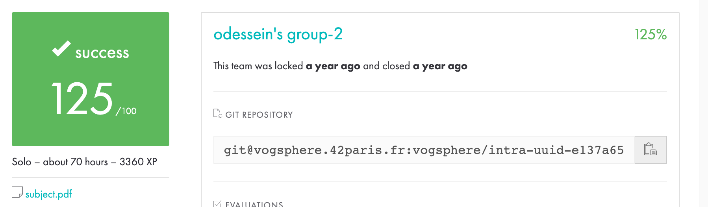

# Dining Philosophers Problem

The Dining Philosophers Problem is a classic synchronization and concurrency problem in computer science, illustrating the challenges of resource sharing and avoiding deadlock in a multi-threaded environment. The scenario is often presented as follows:

## Problem Statement

- There are N philosophers sitting around a dining table.
- Each philosopher alternates between thinking and eating.
- A philosopher needs two resources to eat: the left chopstick and the right chopstick.
- The chopsticks are placed between philosophers.

## Challenge

The challenge in this problem is to design a scheme for the philosophers to safely share the chopsticks, ensuring that they can eat without deadlock or contention. The issues to address include:

1. **Deadlock Avoidance:**
   - Philosophers should not be stuck waiting indefinitely for a chopstick.
   - Deadlock can occur if each philosopher picks up one chopstick and waits indefinitely for the other.

2. **Resource Contention:**
   - Philosophers must avoid conflicts when attempting to pick up or release chopsticks.
   - Two neighboring philosophers must not attempt to grab the same chopstick simultaneously.

## Solutions

Several solutions exist to address the Dining Philosophers Problem, each with its own advantages and drawbacks. Common approaches include:

1. **Mutex Solution:**
   - Use mutex locks to ensure that only one philosopher can pick up a chopstick at a time.
   - Requires careful ordering of operations to avoid deadlock.

2. **Resource Hierarchy Solution:**
   - Assign a unique number to each chopstick and impose a rule that philosophers must acquire chopsticks in a specific order.
   - Helps prevent deadlock by ensuring a global ordering of resources.

3. **Semaphore Solution:**
   - Utilize semaphores to control access to the chopsticks.
   - Allows a certain number of philosophers to eat simultaneously without deadlock.

4. **Asymmetric Solution:**
   - Designate one of the philosophers as left-handed, allowing them to pick up the left chopstick first and the right chopstick second.
   - Breaks symmetry and avoids contention for the same pair of chopsticks.

## Conclusion

The Dining Philosophers Problem highlights the complexities of concurrent programming and the importance of synchronization mechanisms to ensure the safe sharing of resources. Various solutions exist, each with trade-offs in terms of performance, simplicity, and adherence to deadlock avoidance principles.

### Bonus
For the bonus the problem was the same, but instead of each Philosphers being a thread, there were a process. So i use 2 thread to monitor each process. Using semaphores to communicate between processus.

